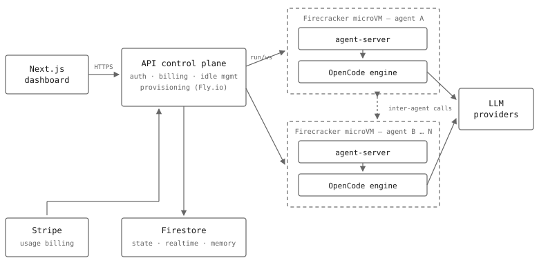

# Michael Hakizumwami

Software engineer — Dallas, TX

Some people mourn the loss of the art of coding, they vehemently oppose the introduction of AI into what was 
their life's work. To me, the creative part of this art was not the tedious writing on the screen. To me the fun part is simply taking what existed in my mind, and making it into a reality. To me the fun part is dreaming up an interesting/impossible piece of software, and thinking up of a way to make it real, and then finding out the hard way why it wasn't possible. I simply love the computer! 

Below you will find repositories both created with AI, and (if i don't private them) repositories made by hand. 
I believe that working with assisted IDE's or agents or whatever comes next is just another step in a beautiful expression of what humans are capable of. There needs to be a bridge sentence or 2 here but I will fix it later. To quote Steve Jobs:

> I grow little of the food I eat, and of the little I do grow I did not breed or perfect the seeds.
> I do not make any of my own clothing.
> I speak a language I did not invent or refine.
> I did not discover the mathematics I use.
> I am protected by freedoms and laws I did not conceive of or legislate, and do not enforce or adjudicate.
> I am moved by music I did not create myself.
> When I needed medical attention, I was helpless to help myself survive.
> I did not invent the transistor, the microprocessor, object oriented programming, or most of the technology I work with.
> I love and admire my species, living and dead, and am totally dependent on them for my life and well being.

People think we won't make it. People focus on the death, sickness and starvation. It has always been there. It is the natural state of things. But in spite of all things, we create beauty. We create love. We create technology. We dare challenge the gods.

[Site & resume](https://mikeycantcode.github.io/resume/) · [LinkedIn](https://linkedin.com/in/mikehakiz) · [mhakizu1@gmail.com](mailto:mhakizu1@gmail.com)

## Robot Handwriting VLA

Taught an SO-ARM101 arm to write ish (still only somewhat functional in sim). MuJoCo + PPO curriculum, LoRA post-training of π₀.₅ (3B VLA), then a GRPO-style RL loop ~$7/iteration on Modal.

  
  

*Demo video on the [resume site](https://mikeycantcode.github.io/resume/).*

## better cmux

My build of [cmux](https://github.com/manaflow-ai/cmux) — my favorite terminal tool. Merged in some design ideas from herdr that I liked & 

## kmj.partners

Conversational outreach platform for creator clients — FastAPI/Postgres, self-hosted quantized LLM inference on 4090s. ~500K personalized touchpoints; 8-person team, $600K revenue.

## in10nt.ai

Persistent AI agents in Firecracker-microVM sandboxes for DevOps automation, architected for thousands of concurrent agents.

<picture>
  <source media="(prefers-color-scheme: dark)" srcset="assets/in10nt-arch-dark.svg">
  
</picture>

---

**Day job** — Artifactory platform @ Capital One: CI/CD + artifact distribution for 600+ apps bank-wide.

**Stack** — Python · TypeScript · Go · FastAPI · React/Vue · AWS · Kubernetes · Postgres · Modal · MuJoCo/JAX
