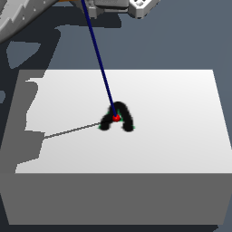
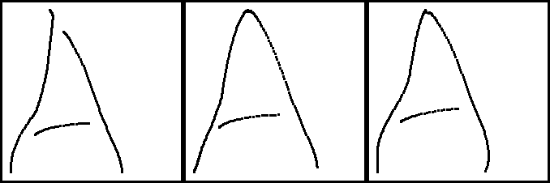
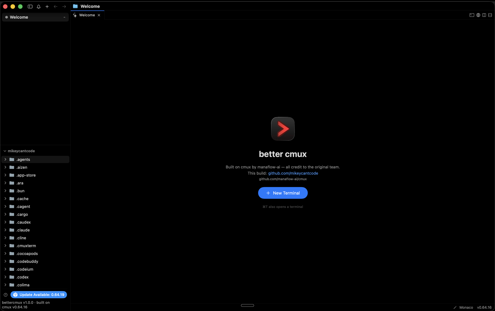

# Michael Hakizumwami

Software engineer — Dallas, TX. Platform engineering at Capital One by day; robot post-training and production agents by night.

[Site & resume](https://mikeycantcode.github.io/resume/) · [LinkedIn](https://linkedin.com/in/mikehakiz) · [mhakizu1@gmail.com](mailto:mhakizu1@gmail.com)

## Robot Handwriting VLA

Taught an SO-ARM101 arm to write. MuJoCo + PPO curriculum, LoRA post-training of π₀.₅ (3B VLA), then a GRPO-style RL loop that beat the SFT ceiling 2× — ~$7/iteration on Modal.

  
  

*Demo video on the [resume site](https://mikeycantcode.github.io/resume/).*

## better cmux

My build of [cmux](https://github.com/manaflow-ai/cmux) — an agent-native terminal I daily-drive.

## kmj.partners

Conversational outreach platform for creator clients — FastAPI/Postgres, self-hosted quantized LLM inference on 4090s. ~500K personalized touchpoints; 8-person team, $600K revenue.

## in10nt.ai

Persistent AI agents in Firecracker-microVM sandboxes for DevOps automation, architected for thousands of concurrent agents.

---

**Day job** — Artifactory platform @ Capital One: CI/CD + artifact distribution for 600+ apps bank-wide.

**Stack** — Python · TypeScript · Go · FastAPI · React/Vue · AWS · Kubernetes · Postgres · Modal · MuJoCo/JAX
